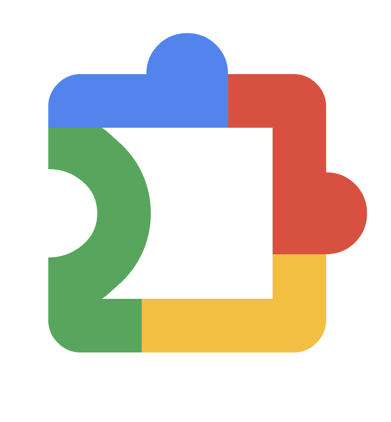

# Hi, I'm Ayoub Odf 👋

I build practical software across AI automation, Flutter, Android, browser extensions, and local-network tools. My projects focus on solving real problems with clean interfaces, reliable automation, and privacy-conscious architecture.

## Engineering dashboard

[Explore the live GitHub Engineering Dashboard](https://ayoubodf-dev.github.io/github-api-portfolio-showcase/) for a focused view of my repositories, technologies, and current engineering work.

## Featured projects

### [Jarvis Local Assistant](https://github.com/ayoubodf-dev/jarvis-showcase)

A local-first AI assistant with voice interaction, macOS automation, a FastAPI backend, React interface, and Android clients.

`Python` `FastAPI` `React` `Android` `AI`

### [IPTV Player](https://github.com/ayoubodf-dev/iptv-player-showcase)

A multi-platform Flutter IPTV client supporting live television, video on demand, EPG, casting, and TV remote control.

`Flutter` `Dart` `Android` `Media`

### [LocalLink](https://github.com/ayoubodf-dev/locallink-showcase)

Direct local-network file sharing between macOS and Android, designed for fast transfers without relying on cloud storage.

`Flutter` `Dart` `macOS` `Android` `Networking`

### [StreamCatcher](https://github.com/ayoubodf-dev/streamcatcher-showcase)

An Electron download manager with a companion Chrome extension for direct media and unencrypted HLS downloads.

`JavaScript` `Electron` `Chrome Extensions` `HLS`

### [Venu](https://github.com/ayoubodf-dev/venu-showcase)

A full-stack, location-aware social platform with real-time chat, calls, and mobile clients.

`JavaScript` `Node.js` `Mobile` `Real-time`

### [SC300 Remote Manager](https://github.com/ayoubodf-dev/sc300-remote-manager-showcase)

A private-network dashboard for managing Android TV boxes through Node.js, ADB, and an Android companion.

`JavaScript` `Node.js` `ADB` `Android`

### [Gmail Organizer](https://github.com/ayoubodf-dev/gmail-organizer-showcase)

A productivity extension with rule previews, bulk inbox organization, analytics, and optional AI-assisted summaries.

`JavaScript` `Chrome Extensions` `Gmail` `Automation`

> Production source code is maintained privately. The linked repositories are
> source-free product showcases with architecture and demonstration media.

## Languages and Tools

  
  
  
  
  
  
  
  
  
  
  
  
  
  
  
  
  
  
  

- **Languages:** Python, JavaScript, TypeScript, Dart, Kotlin
- **Frontend:** React, Flutter, Electron, Chrome Extensions
- **Backend:** FastAPI, Node.js, Firebase, Google Cloud, REST APIs, WebSockets
- **Platforms:** macOS, Android, Android TV, Chrome
- **Interests:** AI agents, workflow automation, local-first software, media tools

## What I'm working on

- Building useful AI assistants and automation workflows
- Improving cross-platform Flutter and Android applications
- Developing privacy-conscious tools that work on local networks
- Turning working prototypes into documented, tested products

## Connect

- Explore the public showcases and open an issue if you would like to discuss a project.
- I am open to freelance development, collaboration, and practical software opportunities.

## Support

If my work helps you, you can support continued development, device testing, and documentation through PayPal:

